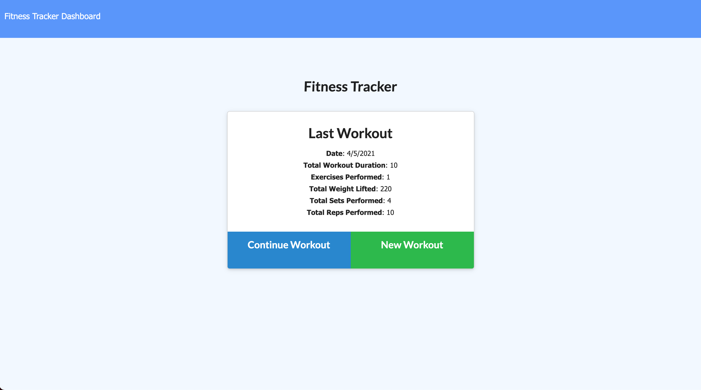

# Workout-Tracker-17

## Table Of Content

    1. Description
    2. Business Context
    3. User Story
    4. Acceptance Criteria
    5. Links

## Description
For this week homework assignment, the task is to create a workout tracker. The front end code in the `Develop` folder was already provided. All that was required was to create Mongo database with a Mongoose schema and handle routes with Express.

## Business Context

A consumer will reach their fitness goals more quickly when they track their workout progress.

## User Story

* As a user, I want to be able to view create and track daily workouts. I want to be able to log multiple exercises in a workout on a given day. I should also be able to track the name, type, weight, sets, reps, and duration of exercise. If the exercise is a cardio exercise, I should be able to track my distance traveled.

## Acceptance Criteria

When the user loads the page, they should be given the option to create a new workout or continue with their last workout.

The user should be able to:

  * Add exercises to the most recent workout plan.

  * Add new exercises to a new workout plan.

  * View the combined weight of multiple exercises from the past seven workouts on the `stats` page.

  * View the total duration of each workout from the past seven workouts on the `stats` page.

  ## Links

  [Heroku Link](https://polar-brushlands-19024.herokuapp.com/)

